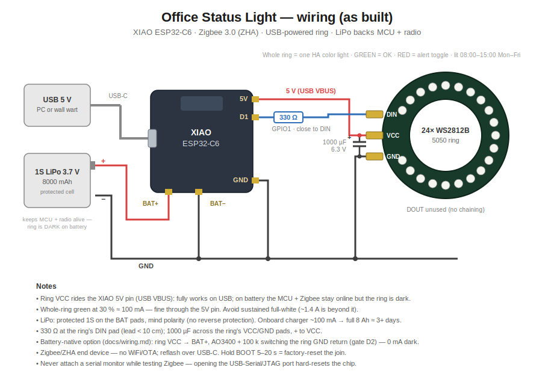

# Wiring — Office Status Light (Zigbee)

One unit = XIAO ESP32-C6 + 24-LED WS2812B ring (+ optional AO3400 low-side
FET) with a 1S LiPo (8000 mAh) on the XIAO's BAT pads. The radio is Zigbee
3.0 (ZHA); there is no WiFi and no OTA — reflash over USB-C.

## Two wiring variants

**As-built (unit 1, 2026-07-16):** the rev 1 wiring plus a LiPo — ring VCC
on the XIAO **5V pin**, ring GND straight to GND (no FET), LiPo on BAT+/−.

- On USB power: fully functional (5V pin is live, ring works).
- On battery: MCU + Zigbee stay online, **ring is dark** — the 5V pin is
  USB-VBUS passthrough only; the battery never feeds it. The LiPo is a
  battery-backed *controller*, not a battery-powered *light*.
- The firmware's gate pin (D2) is a harmless no-op without the FET.

**Battery-native (diagram below):** ring VCC from **BAT+**, AO3400 + 100 k
gating the ring's GND return. Ring lights on battery; dark hours cost 0 mA.
The rest of this document describes this variant.

## Connections

| From | To | Notes |
|---|---|---|
| LiPo + | XIAO `BAT+` pad (underside) | 1S 3.7 V **protected** cell; no reverse-polarity protection on the pads |
| LiPo − | XIAO `BAT−` pad (underside) | |
| `BAT+` junction | Ring `VCC` | The XIAO **5V pin is dead on battery** — ring VCC must come from BAT+ |
| XIAO `D1` (GPIO1) | 330 Ω → Ring `DIN` | Resistor at the ring's DIN pad; keep lead < 10 cm |
| Ring `GND` | AO3400 **drain** | Ring's ground return is switched, not tied to GND |
| AO3400 **source** | GND | |
| AO3400 **gate** | XIAO `D2` (GPIO2) | 100 kΩ from gate to GND so the ring stays off during boot/flash |
| Ring `VCC` ↔ Ring `GND` | 1000 µF 6.3 V electrolytic | At the ring; stripe/short leg (−) to the ring-GND side |

`DOUT` unused. USB-C is for charging and flashing only.

## Why the FET

WS2812Bs draw ~1 mA per LED even when displaying black — ~20 mA continuous
for a 24-LED ring, which would dominate the battery budget. The AO3400 opens
the ring's ground return whenever all four segments are off, so the ISA-101
all-OK state (dark ring) costs 0 mA. Firmware drives the gate automatically
(`update_gate` script).

Low-side switching means the ring's DIN could phantom-power the string
through its input-protection diode if the data line idled high — it doesn't:
WS2812 data idles low, and the firmware only writes frames when a segment
changes.

## Power budget (v1 firmware, honest numbers)

- C6 as an always-on Zigbee end device (radio RX on): **~25 mA baseline**
- 8000 mAh cell → **roughly 10–14 days per charge** with the ring mostly dark
- Exception displayed: add ~20 mA ring idle + ~10–40 mA for six dim LEDs
- **v2 plan:** sleepy end device with short poll interval — cuts baseline to
  well under 1 mA, but needs bench validation that queued ZHA commands
  survive the poll window. Tracked in the README.

Charging reality: the XIAO's onboard charger is ~100 mA — a full 8 Ah
recharge takes 3+ days of USB time. Top off overnight regularly, charge the
cell externally, or add a TP4056-class 1 A charger board.

## Voltage notes

- WS2812B on 3.7–4.2 V: in spec, slightly dimmer than at 5 V, colors fine.
- Logic margin *improves* on battery: VIH = 0.7 × VDD ≈ 2.6–2.9 V, which the
  C6's 3.3 V data line clears comfortably — the 5 V level-shift concern from
  the wall-powered design is gone.

## Assembly notes

- Solder the cap and 330 Ω at the ring's pads; FET + 100 k on a small perf
  square near the ring's GND pad. Everything tucks behind the ring in the
  3D-printed diffuser/stand (design TBD).
- Battery monitoring: the XIAO C6 has **no built-in VBAT divider**. To report
  battery to HA, add a 200k/100k divider from BAT+ to A0 (GPIO0) and enable
  the commented `sensor:` block in the firmware.
- First flash over USB (`esphome run firmware/status-light-don-office.yaml`
  from the RAZORCREST build env, `esphome-status` dir). Pairing: open ZHA
  "Add device" — the light joins automatically when unjoined. Hold the BOOT
  button 5–20 s to factory-reset the Zigbee join.
